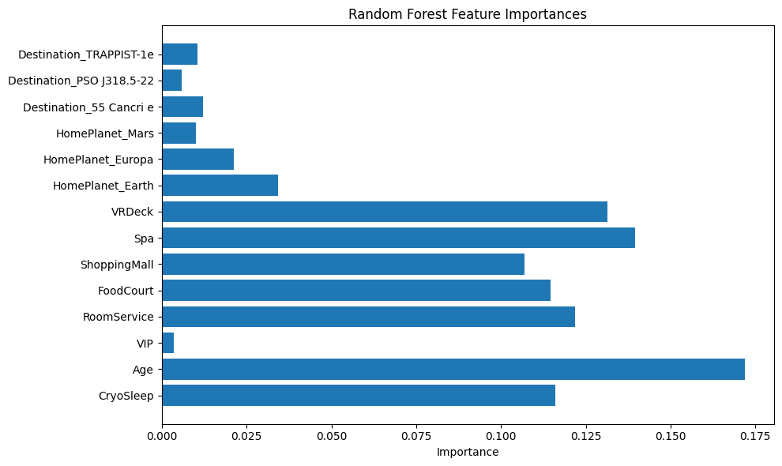

#Space Titanic Project Report 

For the fourth project I decided to try another Kaggle competition, so I chose the Spaceship titanic option. The point of the project is to help "predict which passengers were transported by the anomaly using records recovered from the spaceship’s damaged computer system." To do this I used the two data sources in the competition that I pulled into my code. With those data sets to do the prediction I used the parts of the data like age, home planet, the passenger id and more. For this project I used a random forest which is numerous decision trees. 

I chose this one becuase I like the lasted Kaggle competition that we did so I wanted to try another. I like the automatic score that we get bak from submitted the work done. Also, I liked this challenge in general and thought that it let me use different techniques that we have worked one over the summer, especially with a focus on a random forest/decision tree. 

As directed I pulled the data from Kaggle. Then I cleaned up data which was some parts of missing data to clean out and encoded some of the variables. Then my main method was to use the random forest and also the data was split using a train test split. I had most the training and testing accuracy and then created a graph to show which of the tested features had large infleucnes on the models predictions. 

First, when I submitted the work of the csv that was created by the code I recieved a 0.77998 in Kaggle, which I received twice, so my results were decent. I then also got a training acuacy of 0.9319 and testing accuracy score of 0.7978, so they were both high too, so it was fitting the data well, but not overfitting it.

The graph that was produced here shows that the variables like age, VRDeck, spa, and room service were the most infleunctial while the variables like VIP status or destination did not matter nearly as much. 

Implications of the model is that the model was successful. Knowing which variables were more infleuntial are helpful for the implcations such as age, where it being an inmportant features implys that youngers passengers are more likely to be transported. Or that people in cyrosleep mode have better chance of being transported. The model implys that these results are accuracte based on the accruacy resutls that were given. 

Limitations of this work is that I had to drop some fo the rows sbecuase of missing data becuase I wouldnt have the information to try to fill them in so this limited some fo the data that was used. Also, while the testing accuracy had a lower score, the training accuracy was pretty high which would be a little bit of overfitting, which I can assume is a result of using teh random forest model. 

To work on this model futher or make some improvments is first to better handle the missing data. So for those that were dropped it would be better to estimate the missing information or try other methods to replace the missing information rather than dropping them. Also, there are parts of the infromation that could broken down into more spceific information. The variable cabin could be recorded even further by something like room number so i could look more indepth to patterns of certain rooms blocks possibly having differnt transportation results. 

For this final project of class I used a random forest to particpate in another Kaggle competition. I had to clean the data then create the model which I included using of the train test split technique. The training accuracy was hgiher than the testing accuracy, which could be slkighyl overfitting, but the results were good and inedicates certain variables like age or cyrosleep have more of an impact on if people were transported. 

